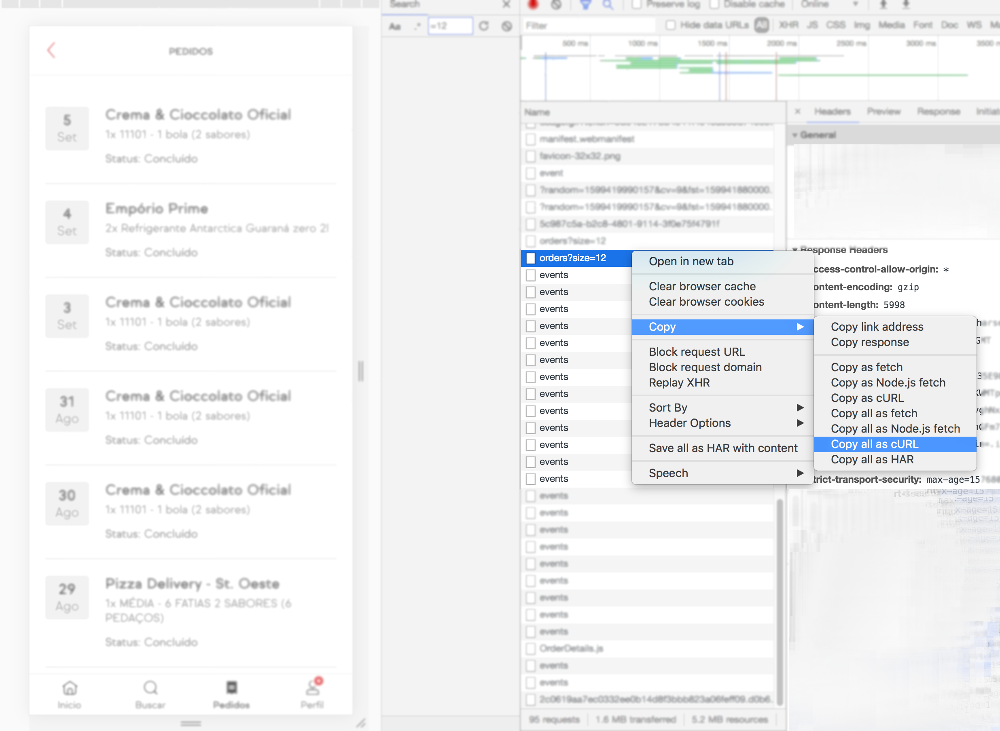

<a href="https://hub.docker.com/repository/docker/guilhermecoutinho/ifood-order-history"></a>
# Ifood order history exporter
This program exports ifood's order history to a tabulated format separated by tabs. The data looks like this:

| Date of order  | Establishment name | Price | Orderem items separated by a semi-colon
| ------------- | ------------- | ------------- | ------------- |
| 1-August-2020 |	Ice cream store |	29.97 |	0001 - 1 ice cream cone (2 flavours); 0002 -  1 ice cream cone (3 flavours);

## Usage

### Getting the URL from ifood

Load the **orders tab** webPage  while the developers console is open in the **network tab**. Find the *orders?size={number}* request in the list and press the button highlited in the image below. 
The button is available in the chrome developer tools 



---

### Running the program
The program will use the URL directly from your clipboard, like a Ctrl-V. Dates are formatted in dd-mm-yyyy

#### Using docker 
<a href="https://hub.docker.com/r/guilhermecoutinho/ifood-order-history/tags"></a>

```docker run --rm -e "CURL_REQUEST=$(eval pbpaste)" guilhermecoutinho/ifood-order-history```

#### Clone and run
Dependencies: golang:

```make run  # runs the program with no date filters```

```make run STARTING_DATE=01-08-2020 END_DATE=01-09-2020```


### Changing the filter
I suggest you take a look at the *.go files* to see what you can do with it. Change the filter inside main:
	
```
filter := func(o *Order) bool {
    return o.LastStatus == "CONCLUDED" &&
        o.CreatedAt.After(startingDate) &&
        o.CreatedAt.Before(endDate)
}
```
